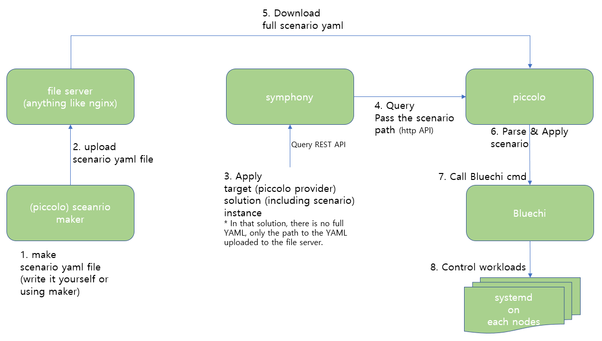

# 3-way integration test

This branch describes the [Bluechi](https://github.com/eclipse-bluechi/bluechi) - [Pullpiri](https://github.com/eclipse-pullpiri) - [Symphony](https://github.com/eclipse-symphony/symphony) integration testing process. The contents is continuously updated.

**Note** : Pullpiri is currently under preparation. This document was written based on the former name, Piccolo.

## Test environment

Use 2 nodes with similar specification.

OS : CentOS Stream 9  
Architecture : x86-64

Disable firewalld  
selinux permissive mode

## Tools

### Bluechi

Refer to [Bluechi Documentation](https://bluechi.readthedocs.io/en/stable/getting_started/multi_node/).

### Piccolo

Clone [piccolo-bluechi](https://github.com/youngtaekiim/piccolo-bluechi). (temporary personal repository for testing.)  
Piccolo is built and runs at the container level, so there is nothing to install separately.

### Symphony

Clone [symphony-piccolo](https://github.com/youngtaekiim/symphony-piccolo).  
Since the symphony for piccolo has not been released yet, I have temporarily uploaded it to my personal repository.

I had to install the Golang build environment because my tests showed that it doesn't work well in containers, so I used a locally built binary. Refer to [install golang](https://go.dev/doc/install).

## Overview



## Configuration before installation

### Bluechi 

If you have read and followed the bluechi documentation carefully, you will know all the basics.
You just need to set the hostname of each node.
I used HPC, ZONE.
```sh
# in main node
hostnamectl hostname HPC
# in guest node
hostnamectl hostname ZONE
```

### Piccolo

You can find `piccolo.ini` in root folder of Piccolo repository.
Piccolo only needs to be installed on the main node.
```ini
HOST_IP=192.168.50.104
GUEST_SSH_IP=192.168.50.239:22
;if you fix YAML_STORAGE, to fix Makefile is also needed. (make install)
YAML_STORAGE=/root/piccolo_yaml
HOST_NODE=HPC
GUEST_NODE=ZONE
GUEST_NODE_ID=root
GUEST_NODE_PW=1q2w3e4r
DOC_REGISTRY=http://192.168.50.104:41234
;more items will be added
```

### Symphony

There are currently no special settings you need to change.

## Build and installation

### Bluechi

Bluechi can be easily installed via `dnf`.

### Piccolo

```sh
# build container image
make image
# prepare testing
make pre
# running piccolo containers
make install
```

### Symphony

```sh
# assume you are under the repo root folder
cd api
go build -o ./symphony-api
# launch symphony
SYMPHONY_API_URL="http://localhost:8082/v1alpha2/" \
USE_SERVICE_ACCOUNT_TOKENS="false" \
./symphony-api -c ./symphony-api-no-k8s.json -l Info
```

## Running tests

It will be updated.